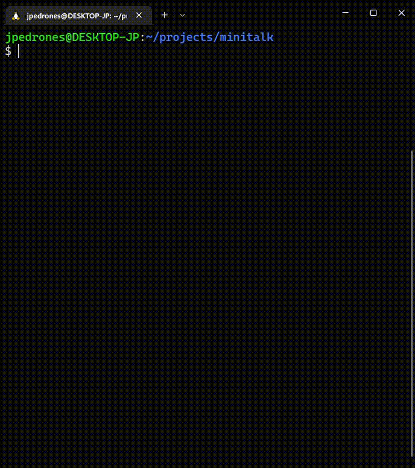
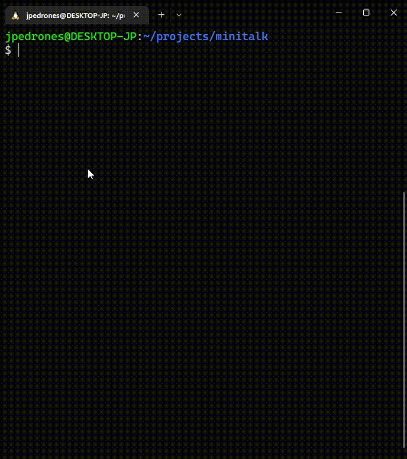

# Minitalk
Este projeto possui dois programas, o `server` e o `client`.
O `client:` interpreta strings recebidas como argumento e envia ao `server` os sinais linux USR1 e USR2, esses sinais serão interpretados pelo `server` como USR1 simulando o bit 1 e USR2 simulando o bit 0, assim o programa é capaz de reformar os caracteres e imprimi-los na saída padrão.

### Como executar
```
$ make
```
Em terminais diferentes execute o servidor, e depois execute o cliente
```
$ ./server
```
```
$ ./client [PID Number] [Message]
```

SERVER                        |  CLIENT
:----------------------------:|:------------------------------:
  |  
